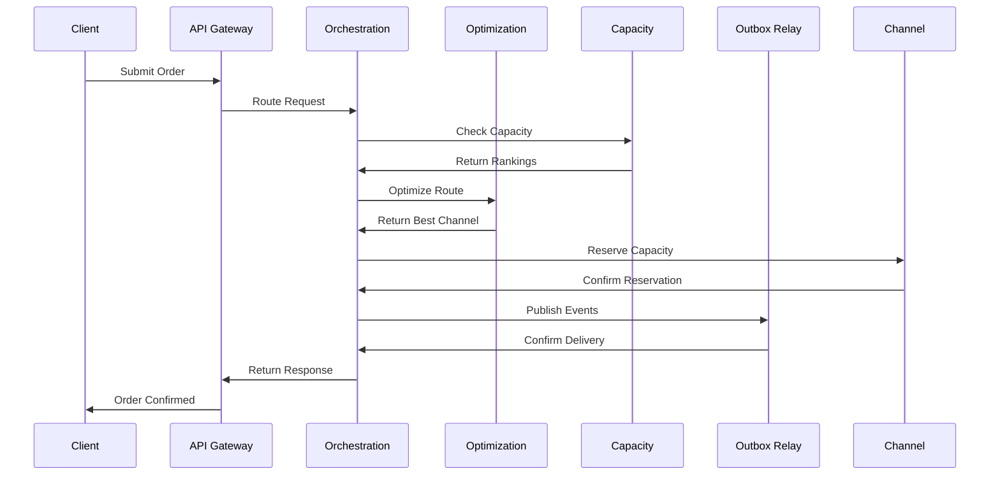
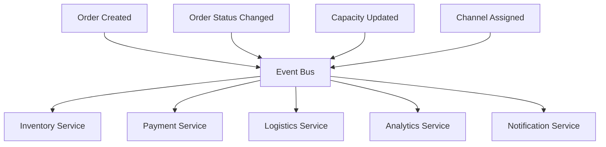

# Unified Order Orchestration Platform (UOOP) - High-Level Design

## Executive Summary

The Unified Order Orchestration Platform (UOOP) is a cloud-native, event-driven microservices architecture designed to handle Calo's high-volume order traffic (5k+ RPS) while maintaining sub-2-second P99 latency and supporting 10x growth with flat infrastructure costs. The platform intelligently routes orders to optimal fulfillment channels using real-time capacity data and provides complete order lifecycle tracking with graceful degradation during partner outages.

## Problem Statement

### Business Context
Calo is a BTC food-tech company providing personalized meal plans through ~20 microservices handling ordering, menu personalization, payments, logistics, and analytics. The company needs to:
- Reduce meal delivery lead time
- Support 10x growth over 12 months
- Keep infrastructure costs flat
- Handle 5k+ RPS during peak traffic

### Technical Challenges
1. **High-Volume Order Processing**: 5k+ RPS with P99 latency ≤ 2s
2. **Intelligent Routing**: Real-time capacity-based channel selection
3. **State Management**: Complete order lifecycle tracking
4. **Event Propagation**: Reliable delivery to 10+ downstream services
5. **Fault Tolerance**: Graceful degradation during partner outages
6. **Cost Optimization**: < $0.05 incremental cost per order

## Architecture Overview

### High-Level Architecture Diagram

```
┌─────────────────────────────────────────────────────────────────────────────┐
│                              CLIENT APPLICATIONS                           │
│  ┌─────────────┐  ┌─────────────┐  ┌─────────────┐  ┌─────────────┐     │
│  │   Web App   │  │  Mobile App │  │   Admin UI  │  │   Analytics │     │
│  └─────────────┘  └─────────────┘  └─────────────┘  └─────────────┘     │
└─────────────────────────────────────────────────────────────────────────────┘
                                    │
                                    ▼
┌─────────────────────────────────────────────────────────────────────────────┐
│                              API GATEWAY                                  │
│  ┌─────────────────────────────────────────────────────────────────────┐   │
│  │  • Rate Limiting (1000 req/min)                                  │   │
│  │  • Authentication & Authorization                                 │   │
│  │  • Request/Response Transformation                               │   │
│  │  • Circuit Breaker Pattern                                       │   │
│  │  • Service Discovery Integration                                 │   │
│  └─────────────────────────────────────────────────────────────────────┘   │
└─────────────────────────────────────────────────────────────────────────────┘
                                    │
                                    ▼
┌─────────────────────────────────────────────────────────────────────────────┐
│                        ORCHESTRATION SERVICE                              │
│  ┌─────────────────────────────────────────────────────────────────────┐   │
│  │  • Order Processing Engine                                       │   │
│  │  • Saga Orchestration (Local + Step Functions)                  │   │
│  │  • Real-time State Management                                   │   │
│  │  • Intelligent Routing Logic                                     │   │
│  │  • Event Publishing (Outbox Pattern)                            │   │
│  └─────────────────────────────────────────────────────────────────────┘   │
└─────────────────────────────────────────────────────────────────────────────┘
                                    │
                                    ▼
┌─────────────────────────────────────────────────────────────────────────────┐
│                        OPTIMIZATION SERVICE                               │
│  ┌─────────────────────────────────────────────────────────────────────┐   │
│  │  • Google OR-Tools CP-SAT Solver                                 │   │
│  │  • Multi-constraint Optimization                                 │   │
│  │  • Real-time Capacity Analysis                                   │   │
│  │  • Route Optimization                                            │   │
│  │  • Cost-Quality-Time Balancing                                   │   │
│  └─────────────────────────────────────────────────────────────────────┘   │
└─────────────────────────────────────────────────────────────────────────────┘
                                    │
                                    ▼
┌─────────────────────────────────────────────────────────────────────────────┐
│                        CAPACITY SERVICE                                   │
│  ┌─────────────────────────────────────────────────────────────────────┐   │
│  │  • Real-time Capacity Tracking                                   │   │
│  │  • Channel Performance Analytics                                 │   │
│  │  • Redis Sorted Sets for Ranking                                │   │
│  │  • Predictive Capacity Planning                                  │   │
│  │  • Channel Health Monitoring                                     │   │
│  └─────────────────────────────────────────────────────────────────────┘   │
└─────────────────────────────────────────────────────────────────────────────┘
                                    │
                                    ▼
┌─────────────────────────────────────────────────────────────────────────────┐
│                        OUTBOX RELAY SERVICE                               │
│  ┌─────────────────────────────────────────────────────────────────────┐   │
│  │  • Reliable Event Publishing                                     │   │
│  │  • At-least-once Delivery Guarantee                             │   │
│  │  • Dead Letter Queue Handling                                    │   │
│  │  • Event Schema Validation                                       │   │
│  │  • Retry with Exponential Backoff                                │   │
│  └─────────────────────────────────────────────────────────────────────┘   │
└─────────────────────────────────────────────────────────────────────────────┘
                                    │
                                    ▼
┌─────────────────────────────────────────────────────────────────────────────┐
│                              DATA LAYER                                   │
│  ┌─────────────┐  ┌─────────────┐  ┌─────────────┐  ┌─────────────┐     │
│  │   Aurora    │  │  DynamoDB   │  │   Redis     │  │    MSK      │     │
│  │ PostgreSQL  │  │   + DAX     │  │ ElastiCache │  │   Kafka     │     │
│  │ (Write DB)  │  │ (Read DB)   │  │ (Cache)     │  │ (Events)    │     │
│  └─────────────┘  └─────────────┘  └─────────────┘  └─────────────┘     │
└─────────────────────────────────────────────────────────────────────────────┘
                                    │
                                    ▼
┌─────────────────────────────────────────────────────────────────────────────┐
│                        FULFILLMENT CHANNELS                               │
│  ┌─────────────┐  ┌─────────────┐  ┌─────────────┐  ┌─────────────┐     │
│  │   Internal  │  │   Dark      │  │  External   │  │   Partner   │     │
│  │   Kitchen   │  │   Store     │  │   Partner   │  │   Network   │     │
│  └─────────────┘  └─────────────┘  └─────────────┘  └─────────────┘     │
└─────────────────────────────────────────────────────────────────────────────┘
```

## Core Components Deep Dive

### 1. API Gateway Service
**Purpose**: Single entry point with intelligent routing and protection

**Key Features**:
- **Rate Limiting**: 1000 requests/minute per client
- **Circuit Breaker**: Prevents cascade failures
- **Request Transformation**: Normalizes incoming requests
- **Service Discovery**: Dynamic service resolution
- **Authentication**: JWT-based security

**Performance**: Sub-50ms latency overhead

### 2. Orchestration Service
**Purpose**: Central order processing engine with saga orchestration

**Key Features**:
- **Hybrid Saga Orchestration**: Local + AWS Step Functions
- **Real-time State Management**: Complete order lifecycle tracking
- **Intelligent Routing**: Multi-factor channel selection
- **Event Publishing**: Reliable outbox pattern
- **Compensation Logic**: Automatic rollback on failures

**Saga Steps**:
1. **Reserve Inventory** → Check channel capacity
2. **Book Partner** → Assign to fulfillment channel
3. **Confirm Order** → Finalize order placement
4. **Compensation** → Rollback on any failure

### 3. Optimization Service
**Purpose**: AI-powered order routing using constraint programming

**Key Features**:
- **Google OR-Tools CP-SAT**: Advanced constraint solver
- **Multi-constraint Optimization**: Time, cost, quality, capacity
- **Real-time Analysis**: < 500ms optimization time
- **Batch Processing**: Efficient multi-order optimization
- **Fallback Logic**: Graceful degradation

**Optimization Factors**:
- Delivery time constraints
- Cost optimization
- Quality scores
- Real-time capacity
- Vehicle type matching

### 4. Capacity Service
**Purpose**: Real-time capacity tracking and channel performance

**Key Features**:
- **Redis Sorted Sets**: High-performance channel ranking
- **Real-time Updates**: Live capacity monitoring
- **Predictive Analytics**: Capacity forecasting
- **Channel Health**: Performance metrics
- **Load Balancing**: Intelligent distribution

### 5. Outbox Relay Service
**Purpose**: Reliable event publishing to downstream services

**Key Features**:
- **At-least-once Delivery**: Guaranteed event delivery
- **Dead Letter Queue**: Failed event handling
- **Schema Validation**: Event integrity
- **Retry Logic**: Exponential backoff
- **Monitoring**: Event delivery metrics

## Data Flow Architecture

### Order Processing Flow



### Event-Driven Architecture



## Data Layer Design

### CQRS Pattern Implementation

**Write Model (Aurora PostgreSQL)**:
- Order entities with full transaction support
- Saga state management
- Outbox events for reliable publishing
- Audit trails and compliance

**Read Model (DynamoDB + DAX)**:
- High-performance order status queries
- Real-time capacity data
- Channel rankings and metrics
- Analytics and reporting

**Cache Layer (Redis ElastiCache)**:
- Session management
- Channel performance rankings
- Real-time capacity data
- API response caching

### Data Consistency Strategy

1. **Eventual Consistency**: Read model updates via events
2. **Strong Consistency**: Write model for critical operations
3. **Caching Strategy**: Multi-level cache with TTL
4. **Data Synchronization**: Event-driven updates

## Performance Optimization

### Latency Optimization

1. **API Gateway Caching**: Response caching with 5-minute TTL
2. **DynamoDB DAX**: Sub-millisecond read latency
3. **Redis Caching**: Hot data in memory
4. **Connection Pooling**: Efficient database connections
5. **Async Processing**: Non-blocking operations

### Throughput Optimization

1. **Horizontal Scaling**: Auto-scaling ECS services
2. **Load Balancing**: ALB with health checks
3. **Database Sharding**: Partitioned by order ID
4. **Event Batching**: Efficient event processing
5. **Circuit Breakers**: Prevent cascade failures

## Fault Tolerance & Resilience

### Circuit Breaker Pattern
```typescript
// Implementation in API Gateway
const circuitBreaker = new CircuitBreaker({
  failureThreshold: 5,
  recoveryTimeout: 30000,
  monitorInterval: 10000
});
```

### Graceful Degradation
1. **Fallback Routing**: Simple round-robin when optimization fails
2. **Cached Responses**: Serve stale data during outages
3. **Queue Buffering**: Handle traffic spikes
4. **Health Checks**: Proactive failure detection

### Disaster Recovery
1. **Multi-AZ Deployment**: High availability
2. **Automated Backups**: Point-in-time recovery
3. **Cross-Region Replication**: Geographic redundancy
4. **Chaos Engineering**: Proactive failure testing

## Security Architecture

### Authentication & Authorization
- **JWT Tokens**: Stateless authentication
- **Role-Based Access**: Fine-grained permissions
- **API Keys**: Service-to-service authentication
- **Rate Limiting**: DDoS protection

### Data Protection
- **Encryption at Rest**: AES-256 encryption
- **Encryption in Transit**: TLS 1.3
- **Secrets Management**: AWS Secrets Manager
- **Audit Logging**: Complete audit trail

## Monitoring & Observability

### Metrics Collection
```typescript
// Prometheus metrics
const orderLatency = new Histogram({
  name: 'order_processing_duration',
  help: 'Order processing latency',
  buckets: [0.1, 0.5, 1, 2, 5, 10]
});
```

### Key Performance Indicators
1. **P99 Order Submission Latency**: Target ≤ 2s
2. **Event Delivery Success Rate**: Target 99.9%
3. **System Availability**: Target 99.95%
4. **Cost per Order**: Target < $0.05

### Alerting Strategy
- **Latency Alerts**: P99 > 2s
- **Error Rate Alerts**: > 1% error rate
- **Capacity Alerts**: < 10% available capacity
- **Cost Alerts**: > $0.05 per order

## Cost Optimization

### Infrastructure Cost Breakdown
1. **Compute (ECS Fargate)**: 40% - Auto-scaling based on demand
2. **Database (Aurora + DynamoDB)**: 30% - Reserved instances for predictable workloads
3. **Cache (Redis)**: 15% - Multi-tenant optimization
4. **Network (ALB + NAT)**: 10% - Data transfer optimization
5. **Monitoring (CloudWatch)**: 5% - Efficient log retention

### Cost Optimization Strategies
1. **Reserved Instances**: 60% cost savings for predictable workloads
2. **Auto-scaling**: Scale down during off-peak hours
3. **Data Lifecycle**: Archive old data to S3
4. **Caching**: Reduce database calls by 80%
5. **Batch Processing**: Efficient resource utilization

## Deployment Strategy

### Phased Rollout Plan

**Phase 1: Foundation (Weeks 1-4)**
- Deploy core infrastructure
- Set up monitoring and alerting
- Implement basic order processing

**Phase 2: Optimization (Weeks 5-8)**
- Deploy optimization service
- Implement intelligent routing
- Add capacity management

**Phase 3: Scale (Weeks 9-12)**
- Load testing and optimization
- Performance tuning
- Production deployment

**Phase 4: Enhancement (Weeks 13-16)**
- Advanced analytics
- Machine learning integration
- Continuous optimization

### Migration Strategy
1. **Blue-Green Deployment**: Zero-downtime migration
2. **Feature Flags**: Gradual feature rollout
3. **Data Migration**: Incremental data sync
4. **Rollback Plan**: Quick recovery procedures

## Risk Assessment & Mitigation

### Technical Risks
1. **High Latency**: Mitigation - Caching, optimization, CDN
2. **Data Loss**: Mitigation - Multi-AZ, backups, replication
3. **Service Outages**: Mitigation - Circuit breakers, fallbacks
4. **Cost Overruns**: Mitigation - Auto-scaling, monitoring

### Business Risks
1. **Capacity Planning**: Mitigation - Predictive analytics
2. **Partner Dependencies**: Mitigation - Multiple partners, fallbacks
3. **Regulatory Compliance**: Mitigation - Audit logging, data governance
4. **Security Breaches**: Mitigation - Encryption, access controls

## Success Metrics & KPIs

### Performance Metrics
- **P99 Order Submission Latency**: ≤ 2s
- **Event Delivery Success Rate**: ≥ 99.9%
- **System Availability**: ≥ 99.95%
- **Order Processing Throughput**: ≥ 5k RPS

### Business Metrics
- **Cost per Order**: < $0.05
- **Order Success Rate**: ≥ 99.5%
- **Customer Satisfaction**: ≥ 4.5/5
- **Delivery Time Reduction**: ≥ 30%

### Operational Metrics
- **Mean Time to Recovery (MTTR)**: < 5 minutes
- **Mean Time Between Failures (MTBF)**: > 30 days
- **Deployment Frequency**: Daily
- **Change Failure Rate**: < 5%

## Conclusion

The UOOP platform provides a comprehensive solution to Calo's order orchestration challenges through:

1. **Scalable Architecture**: Microservices with auto-scaling
2. **Intelligent Routing**: AI-powered optimization
3. **Fault Tolerance**: Circuit breakers and graceful degradation
4. **Cost Optimization**: Efficient resource utilization
5. **Observability**: Comprehensive monitoring and alerting

The platform is designed to handle 10x growth while maintaining performance SLAs and keeping infrastructure costs flat, making it a robust foundation for Calo's expansion plans. 